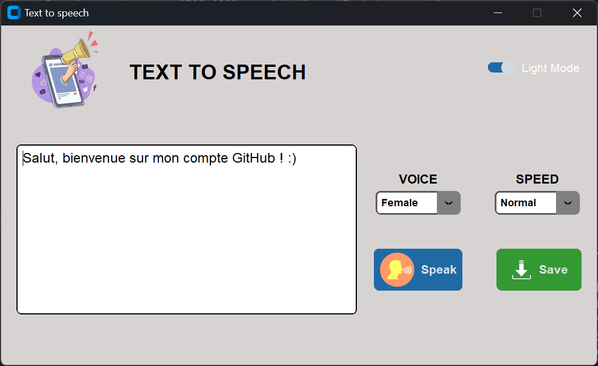
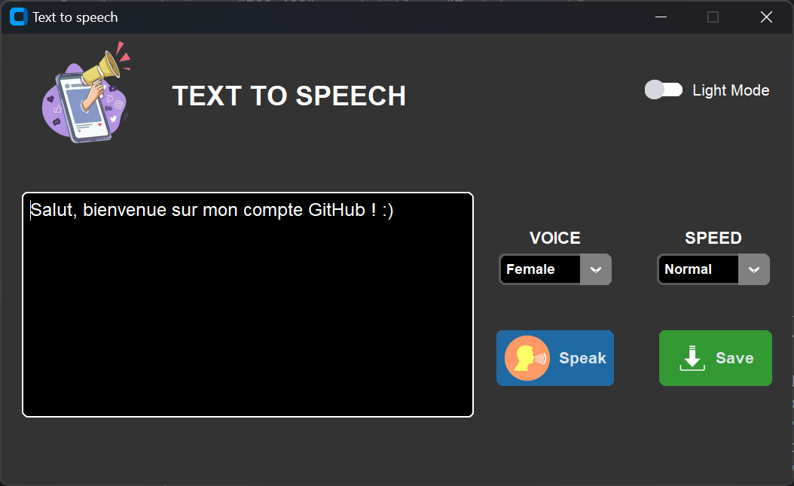

# Python TextToSpeech

Python TextToSpeech est une application développée à l’aide de la bibliothèque d'interface utilisateur graphique CustomTkinter du langage de programmation Python.
Comme son nom l’indique, l’application convertit du texte saisit en parole grâce à la bibliothèque <strong>pyttsx3</strong>. Elle prend également en compte une voix masculine et féminine mais aussi la vitesse du son.

## Présentation de l'application

